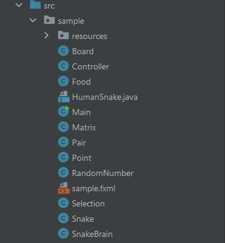

# SnakeAI

Данный проект представляет собой реализацию классической игры "Змейка" (Snake) на Java с использованием нейронной сети и генетического алгоритма. Основная идея проекта заключается в обучении нейронной сети играть в "Змейку" с помощью генетического алгоритма. Генетический алгоритм используется для генерации популяции нейронных сетей. Лучшие нейронные сети имею больший шанс для создания следующей популяции, что позволяет улучшать способность нейронных сетей играть в игру с каждым поколением. В данном проекте используется простая нейронная сеть с одним скрытым слоем.

Ход игры: 
1. Создание игрового поля размером 40x40 тайлов; 
2.	Создание списка из 100 игровых досок; 
3.	На каждой доске создаётся змейка с едой; 
4.	Начинается бесконечный цикл отрисовки экрана и обновления игры; 
5.	Если прошло достаточно времени с последнего обновления, происходят следующие действия:
      1.	Проверка наличия всех живых змеек. Если все змейки живы, они делают ходы. Каждый ход уменьшает выносливость «STAMINA» на 1; 
      2.	Если «STAMINA» == 0 или змейка сталкивается со стеной или c хвостом, то змейка умирает; 
      3.	Если голова змейка касается еды, то счетчик еды «FoodCounter» и длина змейка «LinkedList<Point> body» увеличивается на 1; 
      4.	Если змейка умирает то счетчик живых змеек «countAlive» уменьшается; 
      5.	Если все змейки умерли, запускается процесс создания нового поколения змеек; 
      6.	Игровое поле перерисовывается с помощью функции draw() на основе текущего состояния змеек и еды; 
6.	Функция «spawnNextGeneration» создает новое поколение змеек; 
7.	Шаг 4.

Структура проекта:

